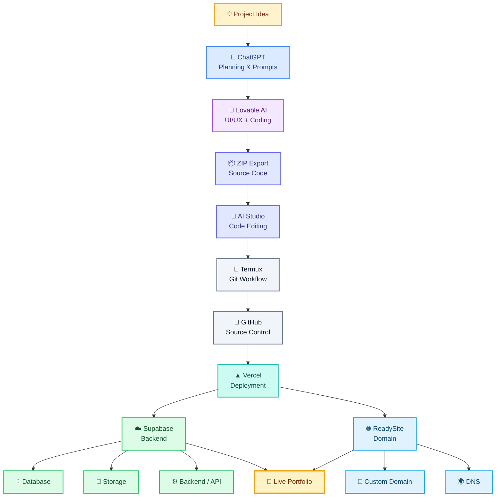

# 🚀 Portfolio Website

### Development & Deployment Workflow

A modern personal portfolio website built through an AI-assisted development workflow, from initial planning and UI/UX design to coding, version control, backend integration, deployment, and custom domain configuration.

---

## 🧩 Development Workflow



---

## 🛠️ Technology Stack

| Category | Technology |
|:---|:---|
| 🤖 AI Planning | ChatGPT |
| 🎨 UI/UX & Development | Lovable AI |
| 🧠 Code Editing | AI Studio |
| 📱 Development Environment | Termux |
| 🐙 Version Control | GitHub |
| 🚀 Deployment | Vercel |
| ☁️ Backend & Database | Supabase |
| 🌐 Domain & DNS | ReadySite |

---

## 🔄 Project Flow

**Idea → ChatGPT → Lovable AI → ZIP Export → AI Studio → Termux → GitHub → Vercel → Supabase + ReadySite → Live Portfolio**

---

## ☁️ Backend Architecture

```text
                 🌐 LIVE PORTFOLIO WEBSITE
                           │
             ┌─────────────┴─────────────┐
             │                           │
             ▼                           ▼
      ▲ Vercel Deployment          🌐 Custom Domain
             │                           │
             ▼                           ▼
       ☁️ Supabase                  ReadySite
             │
      ┌──────┼──────┐
      │      │      │
      ▼      ▼      ▼
   Database Storage Backend
                     / API
```

---

## ✨ About

This portfolio represents an AI-assisted development journey, combining modern development tools, cloud infrastructure, source control, and deployment technologies into a complete web experience.

### 👨‍💻 Designed & Developed by **Yasin Adnan**

> **Building ideas into digital experiences — step by step.**
